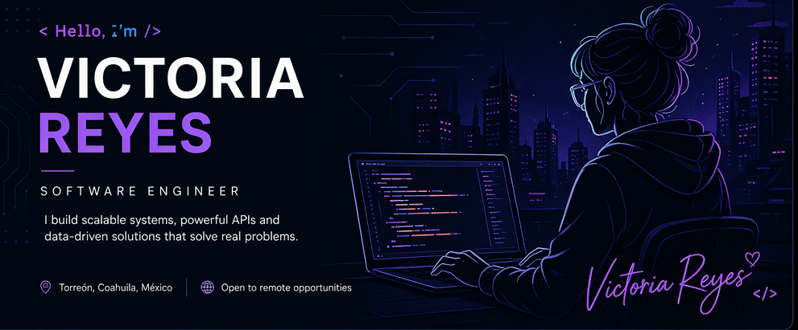

  

 

  <h1>Blanca Victoria Jaime Reyes</h1>
  <h3>Backend Engineer &nbsp;·&nbsp; Data Engineering &nbsp;·&nbsp;</h3>

 

  
  &nbsp;
  
  &nbsp;
  
  &nbsp;
  
  &nbsp;
  

---

## About

Backend & Data Engineer with a focus on **scalable APIs, data pipelines, and multi-tenant platforms**. I design systems that balance performance with maintainability — working across the full backend stack from schema design to infrastructure layer.

Experienced across Node.js, Python, .NET, and PHP ecosystems. Comfortable with relational and document databases, cloud infrastructure, and ETL processes. I approach engineering problems by understanding the business first, then building the simplest system that holds under load.

**Currently open to remote backend and data engineering roles** (US / EU / LATAM).

---

## Core Expertise

  
  
  
  
  
  
  
  

---

## Tech Stack

**Backend & Runtimes**

  

**Data & Databases**

  

**Infrastructure & DevOps**

  

**Frontend & UI**

  

---

## What I Build

| Domain | Focus |
|---|---|
| **Backend Systems** | RESTful APIs, authentication & authorization flows, multi-tenant architectures, microservices |
| **Data Engineering** | ETL/ELT pipelines, data modeling, SQL optimization, reporting and analytics layers |
| **Integrations** | Third-party API connectors, webhooks, payment gateways, CRM and ERP systems |
| **Infrastructure** | Containerized deployments, AWS cloud services, NGINX, CI/CD pipelines |
| **Fullstack** | End-to-end product features with clear separation between domain logic and presentation |

---

## GitHub Stats

  
  &nbsp;
  

  

  

---

  <i>Building systems that scale. Writing code that lasts.</i>

